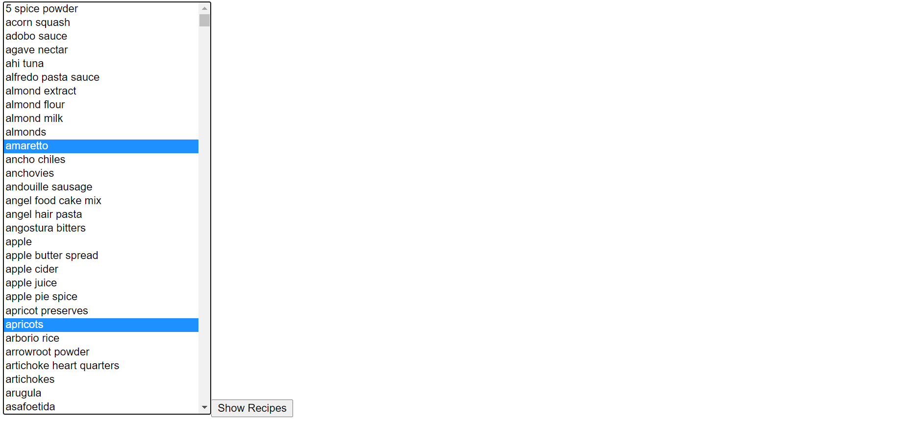
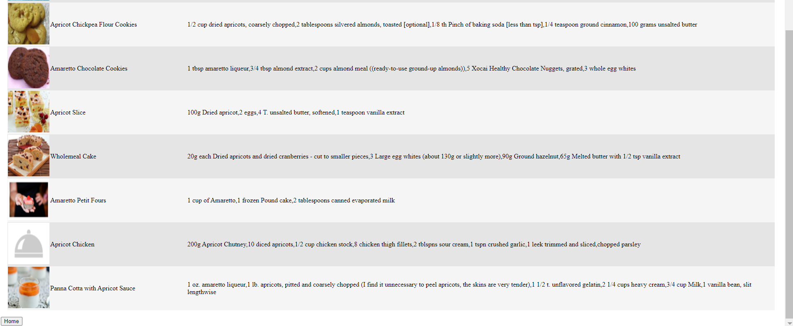

# Web App - Discover Recipes

Using [Spoonacular API](https://spoonacular.com/) to search for recipes based on user input from a dropdown list.

## Tools

- Python
- Spoonacular API
- Sqlite3
- Flask
- Jinja
- Some JS
- HTML
- CSS

## Usage

## Issues

- Wanted to incorporate more Javascript in the code
- Spent a lot of time trying to work with Django and switched to Flask last minute
- More efficient way to load database
- Instead of having to "CTRL" click the items to have multiple choices wanted to include check box and search bar and automatically add items when checking the boxes and removing them likewise
- Better design in general
